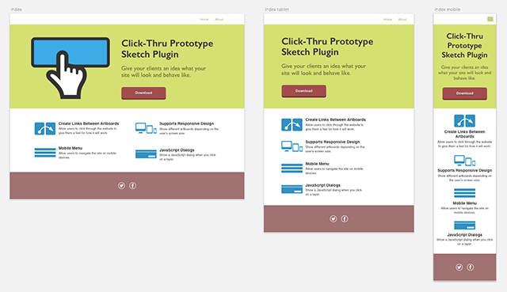
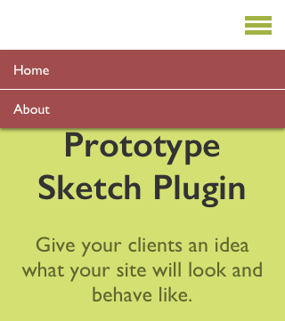

# Click-Thru Prototype

A Sketch plugin that creates a HTML click-through prototype of a website design so you can give your clients an idea what the website will look like. [Here's an example of a website](https://markhorgan.github.io/click-thru-prototype) generated by the plugin. Change the width of the browser to see the different responsive designs.

## Installation

To install, [download the zip file](https://github.com/markhorgan/click-thru-prototype/archive/master.zip) and double-click on `Click-Thru Prototype.sketchplugin`. The commands will show up under `Plugins > Click-Thru Prototype`. To see it in action, open `demo.sketch` and then select `Plugins > Click-Thru Prototype > Export to HTML` or have a look at the generated website in the `docs` folder.

## Usage

You can create links between artboards, add external links or show a JavaScript dialog. When you're finished adding these you can generate a HTML website of the current page by selecting `Export to HTML`. The generated files can then be uploaded to a server so you can show your client. 
 
### Responsive Design 
 
The plugin can handle responsive design, you just need to start your artboards with the same name e.g. `index`, `index tablet`, `index mobile`. When you change the width of your browser it will show a different artboard in the exported website. 
 

### Mobile Menu

On mobile you will want to show a mobile menu rather than the normal horizontal menu. To do this you need to select which layer is the button that shows the menu by selecting `Set Mobile Menu Button`, and which layer is the mobile menu by selecting `Set Mobile Menu`.
 

### Retina Images
 
 By default it will show 2x images for high pixel density screens. To turn this off select `Retina Images Setting` and re-export the page.